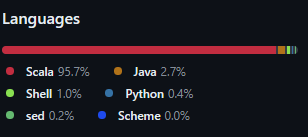

# GeoMesa
Disclamer: Презентация лежит по ссылке [тут](https://docs.google.com/presentation/d/1SGlwLqNVw-BEB36LAadl-SQlVvgcyG11T6YStBPo34w/edit?usp=sharing). Демонстрация разворачивание базы данных и работы с ней в директории GeoMesa/demo
## История развития GeoMesa

GeoMesa - это распределенная пространственная аналитическая база данных с открытым исходным кодом, разработанная в рамках проекта LocationTech, который является частью некоммерческой организации Eclipse Foundation. Она была создана для эффективной обработки больших объемов пространственных данных и поддержки высокопроизводительных геопространственных запросов.
GeoMesa основана на Apache Accumulo, распределенной NoSQL базе данных, ориентированной на столбцы, и Apache Hadoop, фреймворке для распределенной обработки данных. Первая версия GeoMesa была выпущена в 2014 году.

## Инструменты для взаимодействия с GeoMesa

GeoMesa предоставляет несколько инструментов для взаимодействия с базой данных:
- GeoMesa Command Line Tools: Набор утилит командной строки для управления данными, индексами и таблицами GeoMesa.
- GeoServer: GeoMesa интегрируется с GeoServer, открытым исходным кодом сервера географической информационной системы (ГИС), который позволяет публиковать и обслуживать пространственные данные.
- Apache Spark: GeoMesa поддерживает Apache Spark для распределенной обработки и анализа пространственных данных.
- Клиентские библиотеки: GeoMesa предоставляет клиентские библиотеки на Java, Python и других языках для взаимодействия с базой данных через программный интерфейс.

## Database Engine

GeoMesa использует Apache Accumulo в качестве основного движка базы данных. Apache Accumulo - это распределенная NoSQL база данных, ориентированная на столбцы, которая построена поверх Apache Hadoop и предназначена для обработки больших объемов данных.

## Как устроен язык запросов в вашей СУБД? Разверните БД с данными и выполните ряд запросов. 

GeoMesa использует язык запросов CQL (Contextual Query Language), который является расширением стандартного языка запросов OGC для пространственных данных. CQL позволяет выполнять запросы, фильтрующие данные как по пространственным, так и по непространственным атрибутам.
Основные особенности CQL в GeoMesa
- Пространственные фильтры: CQL поддерживает широкий спектр пространственных операторов и функций, таких как INTERSECTS, WITHIN, DWITHIN (пространственный буфер) и др. Это позволяет выполнять запросы на основе геометрии объектов - точек, линий, полигонов.

Пример: `filter='geom WITHIN(POLYGON((...)))'` - возвращает объекты, геометрия которых находится внутри заданного полигона.
- Фильтры по атрибутам: Помимо пространственных фильтров, CQL позволяет фильтровать данные по непространственным атрибутам, таким как строки, числа, даты и т.д., используя стандартные операторы сравнения.

Пример: `filter='name = "London" AND population > 1000000'`

- Временные фильтры: GeoMesa расширяет CQL для поддержки временных фильтров, позволяя выполнять запросы по временным интервалам или моментам времени.

Пример: `filter='dtg DURING 2022-01-01T00:00:00Z/2022-12-31T23:59:59Z'`
- Комбинирование фильтров: Различные фильтры в CQL могут комбинироваться с помощью логических операторов AND, OR и NOT.

GeoMesa использует оптимизатор запросов, который анализирует CQL-фильтры и выбирает наиболее эффективные индексы и стратегии выполнения запроса для заданного фильтра.

Таким образом, CQL в GeoMesa предоставляет гибкий и мощный язык запросов для эффективной работы с большими пространственно-временными данными, сочетая пространственные, атрибутивные и временные фильтры

## Распределение файлов БД по разным носителям?

GeoMesa использует Apache Accumulo в качестве основного хранилища данных, которое, в свою очередь, использует Apache Hadoop Distributed File System (HDFS) для хранения данных. HDFS распределяет файлы по нескольким узлам кластера, обеспечивая отказоустойчивость и масштабируемость.

## На каком языке/ах программирования написана СУБД?

GeoMesa написана на Scala и Java и имеет клиентские библиотеки для взаимодействия с базой данных на Java, Python и других языках. Но основной язык программирования является Scala.

## Типы индексов

*Виды индексов:*
- Z2/Z3/XZ2/XZ3: Обеспечивают пространственный индекс.
- ID: Используется для уникальной идентификации объектов.
- Атрибуты: Индексы могут быть созданы для конкретных атрибутов.

*Настройка индексов:*
- Задание числа зон (shards) для индексов Z2/Z3 и атрибутных индексов.
- Конфигурация интервала времени для Z3-индекса.
- Указание точности XZ-индекса.
- Разделение индексов на отдельные таблицы (Partitioned Indices).

*Конфигурация разбиения таблиц:*
- Можно указать число разделений (splits) для индексов Z2/Z3/XZ2/XZ3.

## Про пространственные индексы 
Индексы Z2, Z3, XZ2 и XZ3 - это типы пространственных индексов, используемые в GeoMesa для эффективного хранения и запроса географических данных.

**Z2-индекс:**
- Z2-индекс используется для индексации двухмерных пространственных данных.
- Он разбивает географическое пространство на квадратные области с помощью квадратной решетки, нумеруемой от 0 до (2^z)-1, где z - уровень разбиения.
- Каждая точка на поверхности земли получает уникальный код с помощью Z-кривой, которая преобразует двумерные координаты в одномерный индекс.
- Z2-индекс обеспечивает равномерное распределение данных по ячейкам, что улучшает производительность запросов на пространственные диапазоны.

**Z3-индекс:**

- Z3-индекс расширяет концепцию Z2-индекса на трехмерное пространство, включая время.
- Он используется для индексации пространственно-временных данных и разбивает пространство на объемные ячейки.
- Z3-индекс позволяет эффективно выполнить запросы, которые объединяют пространственные и временные условия.

**XZ2-индекс:**
- XZ2-индекс подобен Z2-индексу, но используется для индексации пространственных данных с дополнительной информацией о высоте.
- Это полезно для хранения трехмерных пространственных данных, таких как города, здания или ландшафты.

**XZ3-индекс:**
- XZ3-индекс комбинирует концепции Z3-индекса и XZ2-индекса для индексации пространственно-временных данных с учетом трехмерных координат.
- Этот тип индекса полезен для эффективного хранения и запроса четырехмерных пространственных данных, таких как изменения климата или движение объектов в трехмерном пространстве с течением времени.
- Все эти индексы позволяют быстро и эффективно выполнять запросы на географические данные в больших наборах данных, обеспечивая высокую производительность и масштабируемость.

## Процесс выполнения запросов
Процесс выполнения запросов в GeoMesa включает следующие этапы:
- Query Planning: На этом этапе GeoMesa анализирует запрос и выбирает наиболее подходящие индексы для его выполнения.
- Query Execution: Запрос выполняется параллельно на нескольких узлах кластера Apache Accumulo с использованием выбранных индексов.
- Result Aggregation: Результаты из различных узлов кластера агрегируются и возвращаются клиенту.

## План запросов
GeoMesa использует концепцию "плана запросов" для оптимизации выполнения запросов. План запроса представляет собой последовательность операций, которые должны быть выполнены для получения результата запроса. GeoMesa анализирует запрос и строит оптимальный план запроса, учитывая доступные индексы и статистику данных.

## Поддержка транзакций
GeoMesa поддерживает транзакции через Apache Accumulo. Apache Accumulo обеспечивает изолированность, атомарность, согласованность и долговечность (ACID) транзакций, гарантируя целостность данных при одновременном доступе.

## Методы восстановления
GeoMesa использует механизмы восстановления, предоставляемые Apache Accumulo и Apache Hadoop. Apache Accumulo поддерживает восстановление данных из журналов транзакций, а Apache Hadoop обеспечивает репликацию данных на нескольких узлах кластера для отказоустойчивости.

## Шардинг
GeoMesa использует шардинг (разделение данных на части) для масштабирования и распределения данных по нескольким узлам кластера. Шардинг в GeoMesa основан на пространственных индексах, таких как XZ2 и XZ3, которые разделяют пространственные данные на основе их географического расположения.

## Data Mining, Data Warehousing и OLAP
GeoMesa поддерживает концепции Data Mining, Data Warehousing и OLAP (Online Analytical Processing) для анализа пространственных данных:
- Data Mining: GeoMesa может использоваться для обнаружения закономерностей и извлечения знаний из пространственных данных с помощью алгоритмов машинного обучения и статистического анализа.
- Data Warehousing: GeoMesa может служить в качестве хранилища данных для пространственной информации, объединяя данные из различных источников для аналитических целей.
- OLAP: GeoMesa поддерживает OLAP-операции, такие как агрегация, сверка и сечение, для анализа пространственных данных с различных точек зрения.

## Сообщество разработчиков
GeoMesa является проектом с открытым исходным кодом, который развивается сообществом разработчиков и компаний, участвующих в проекте LocationTech Eclipse Foundation. Права на коммит и создание дистрибутивов версий имеют члены проектной группы GeoMesa, которые активно вносят вклад в развитие проекта.
Некоторые ключевые компании и организации, участвующие в развитии GeoMesa:
- CCRi: Исследовательский институт, который является одним из основных разработчиков GeoMesa.
- Boundless Spatial: Компания, предоставляющая коммерческую поддержку и услуги для GeoMesa.
- Azavea: Компания, специализирующаяся на геопространственных решениях и активно участвующая в развитии GeoMesa.
- Radiant Solutions: Компания, работающая в области геопространственной разведки и использующая GeoMesa в своих продуктах.

## Документация и обучение
Официальная документация GeoMesa доступна на сайте проекта: https://www.geomesa.org/documentation/
Также доступны следующие ресурсы для обучения:
- Учебные материалы: На сайте GeoMesa есть раздел с учебными материалами, включая руководства, видео и примеры кода.
- Вебинары и презентации: Сообщество GeoMesa регулярно проводит вебинары и конференции, где представляются новые возможности и демонстрации.
- Форумы и списки рассылки: Сообщество GeoMesa активно на форумах и списках рассылки, где можно задавать вопросы и обсуждать проблемы.

## Оставаться в курсе событий
Чтобы оставаться в курсе последних событий и обновлений GeoMesa, можно:
- Подписаться на список рассылки проекта GeoMesa: https://locationtech.org/mailman/listinfo/geomesa-dev
- Следить за новостями и анонсами на сайте проекта: https://www.geomesa.org/
- Присоединиться к сообществу GeoMesa на GitHub: https://github.com/locationtech/geomesa
- Посещать конференции и встречи сообщества, где обсуждаются новые функции и планы развития GeoMesa.