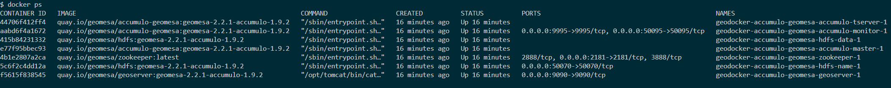
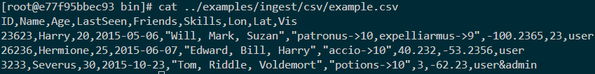
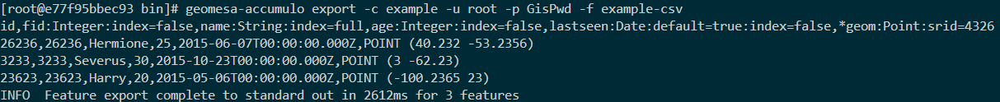
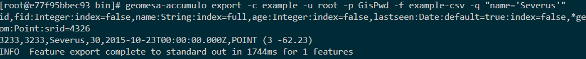
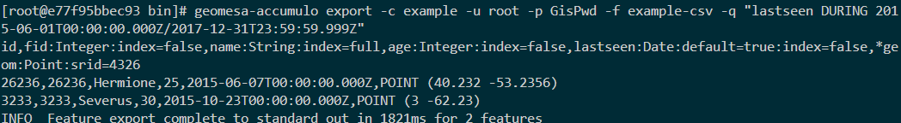
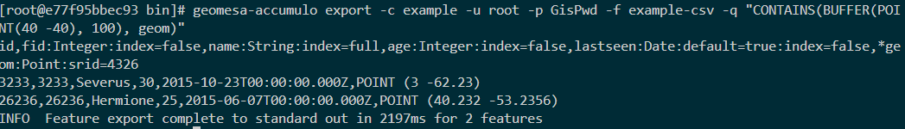
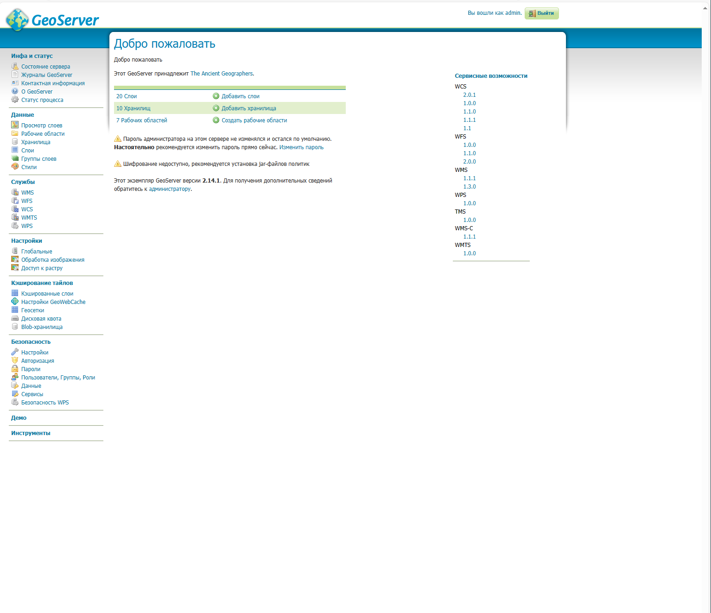
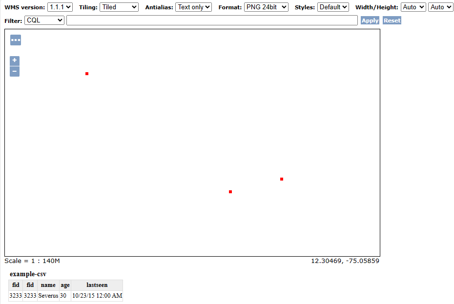
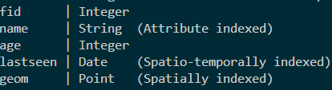

Disclamer: Презентация лежит по ссылке [тут][https://docs.google.com/presentation/d/1SGlwLqNVw-BEB36LAadl-SQlVvgcyG11T6YStBPo34w/edit?usp=sharing]. Демонстрация разворачивание базы данных и работы с ней в директории GeoMesa/demo
# Здесь я расскажу про демонстрация работу с GeoMesa

## План
Мы пройдемся про всем основным аспектам работы с БД
- Развернем инстанс базы данных
- Посмотрим как выглядит уже готовый WebUI для работы с бд
- Напишим пару запросов
- Построим различные индексы 

## Деплой инстанса GeoMesa + запросы 
Для сборки инстанса для работы с бд можно воспользоваться проектом GeoDocker-GeoMessa

`
    git clone git@github.com:geodocker/geodocker-geomesa.git
`

Там уже есть готовый `docker-compose` для поднятия небольшого кластера из HDFS, Zookeeper, Accumulo and GeoServer.

`
    cd geodocker-geomesa/geodocker-accumulo-geomesa
    docker-compose up
`

Здесь мы с вами подняли 7 контейнеров:

Нас интересует Accumulo master instance, тк туда ставятся CLI тулзы для работы с базой данных

Заходим в интерактивном режиме с bash в контейнер 

`
    docker exec -ti geodocker-accumulo-geomesa-accumulo-master-1 bash
`

В контейнере у нас изначально есть несколько примеров данных, которые можно поиспользовать в качестве примеров работы: 
Пасхалка для любителей Гарри Поттера в `/opt/geomesa/examples/ingest/csv/example.csv`

Далее нам необходимо выполнить команду:

`
    cd /opt/geomesa/bin
    geomesa-accumulo ingest -C example-csv -c example -u root -p GisPwd -s example-csv ../examples/ingest/csv/example.csv
`

Команда `ingest` отвечает за конвертацию различных файлов в GeoMesa. Здесь мы создаем используем конвертер `example-csv`, табличный каталог `example`, какой пользователь это делает, в нашем случае из под `root`, пароль, ну и сам файл.

Можем посмотреть на данные:

`
    geomesa-accumulo export -c example -u root -p GisPwd -f example-csv 
`

Теперь какие запросы можно делать с помощью CLI-tools

Команда  `export` дает возможность писать CQL предикаты для запросов к существующим схемам

Посмотрим на примеры: 

1) Атрибутный

2) Временной

3) Простраснтвенный

## WebUI

Давайте теперь взглянем на UI, который у нас есть из коробки. GeoServer разворачивается на порту `9090`, заходим по `http://localhost:9090/geoserver/web/`

Зайдем туда как `admin:geoserver`

Создаем новое хранилище с параметрами:
- `accumulo.instance.id = accumulo`
- `accumulo.zookeepers = zookeeper`
- `accumulo.user = root`
- `accumulo.password = GisPwd`
- `accumulo.catalog = example`

Далее у нас будет возможность 'опубликовать слой', который мы только что создали, и после мы можем воспользоваться `OpenLayer viewer` для того, чтобы взглянуть на наши геоданные.

Вот что у нас получается: 

## Индексы
Создание индексов:

`geomesa-accumulo add-index -u root -p GisPwd --index attr -c example -f example-csv `

Посмотрим на индексы, которые добавили 

